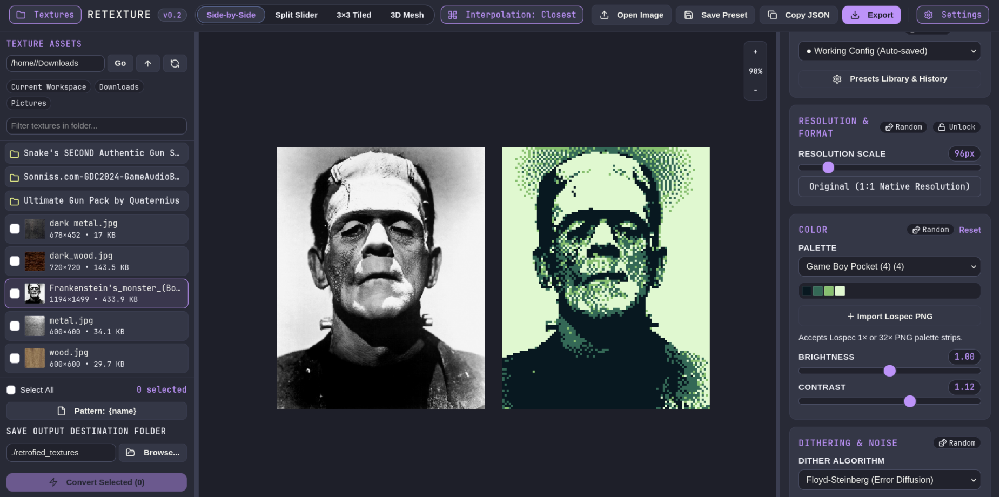
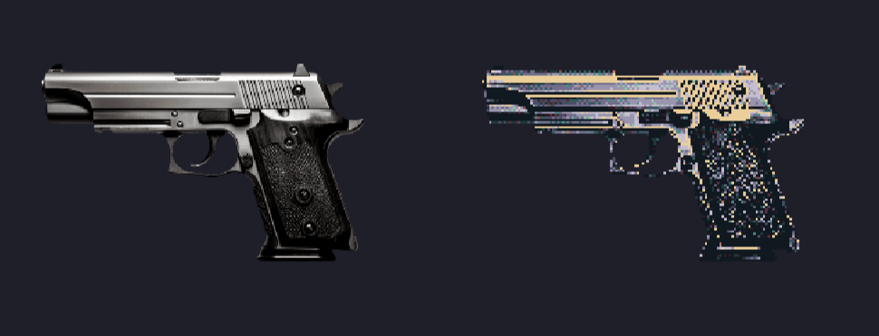
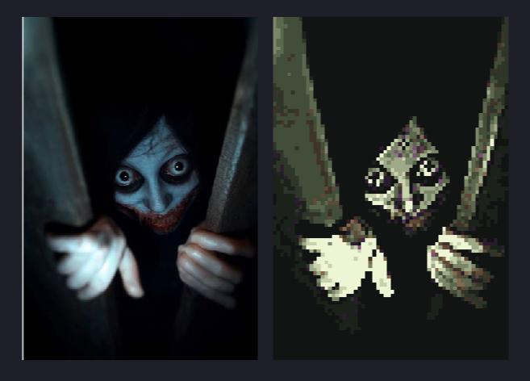
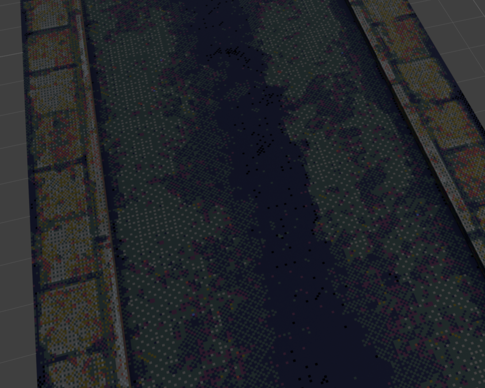
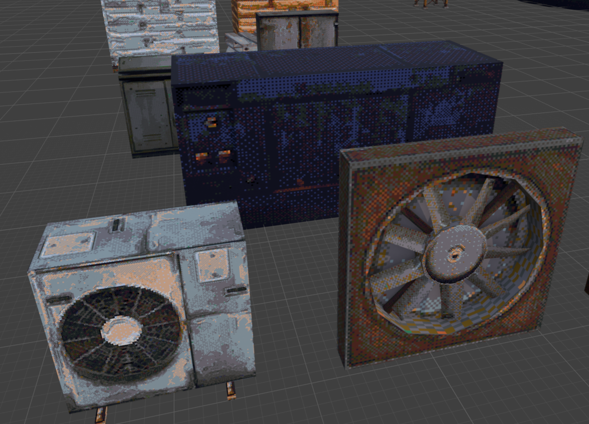
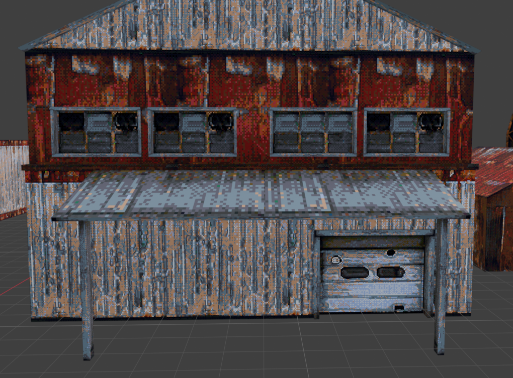
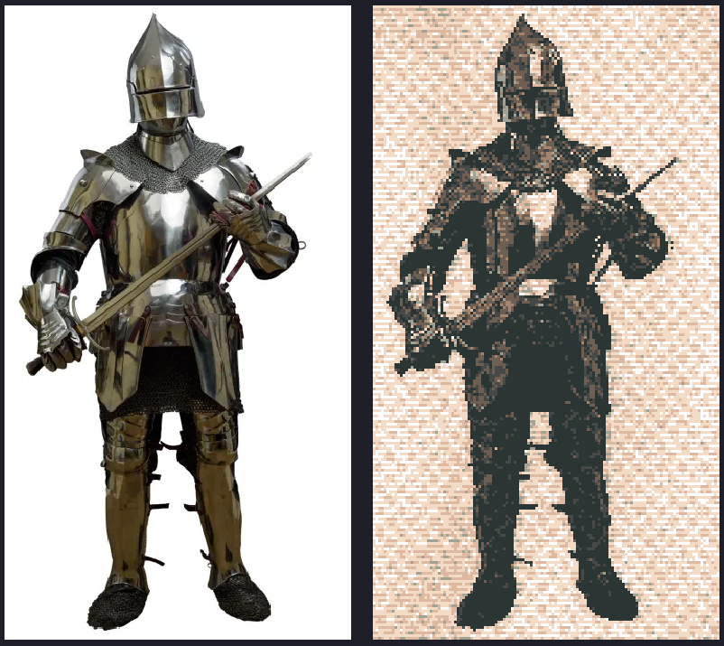

# Retexture

Convert modern textures into retro game textures or pixelart (PS1, boomer shooter, 8/16-bit handheld, halftone)! Interactive viewport with live preview plus a CLI for automation. Both use the same Python pipeline.

# Screenshots









## Features

- Autosave presets: every change you make is autosaved so that you never lose your "perfect" config.
- Seamless tiling.
- Filebrowser and batch operations.
- Batch renaming.
- Multiple preview options.
- A bunch of presets to give you inspiration!

## Requirements

- Python >= 3.10
- `uv` (recommended)

## Quick start

```bash
make setup   # install deps with uv (once)
make gui     # launch studio at http://127.0.0.1:8080
make presets # list palette and style presets
make test    # run test suite
```

Batch conversion:

```bash
uv run retexture batch ./textures -o ./retro_textures --preset signalis_replika
uv run retexture batch ./textures -o ./retro_textures --palette ps1_classic_16 --size 128 --dither bayer4x4
```

## License

AGPL-3.0-only — see `LICENSE`.
